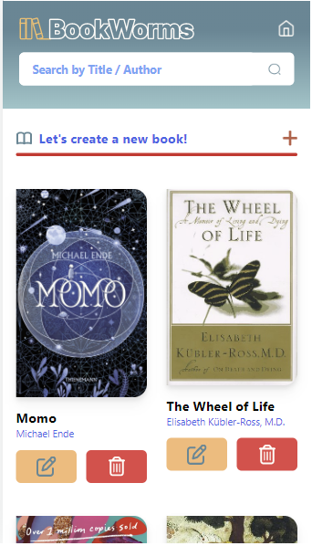
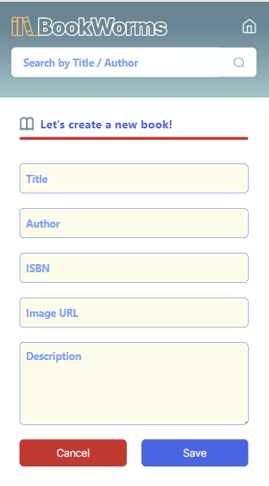
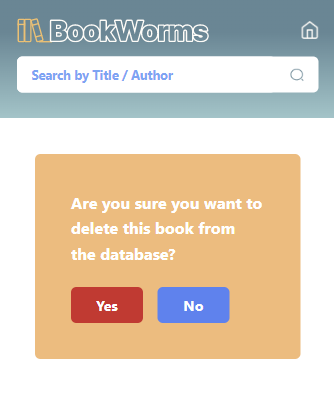
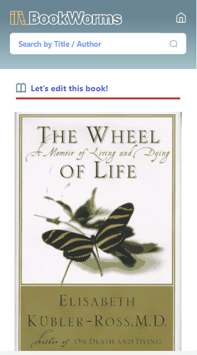
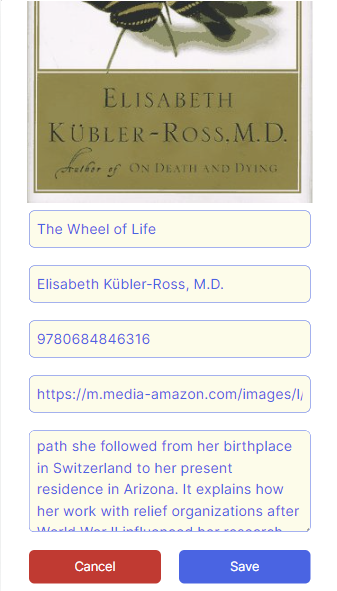

# BookWorms

:closed_book: Library (Biblioteca) project for FemCoders promotion. CRUD PHP project using MySql database.

## Table of contents

1. [Description of the project](#Description-of-the-project)
2. [Characteristics and screenshots of the project](#Characteristics)
3. [Access to the project](#Access)
4. [Tools used](#Tools-used)
5. [Authors](#Authors)

## Description of the project
***
Using PHP as a backend language and MySql as a database, we applied CRUD (Create, Read, Update and Delete). Our database has a table with six fields for each register (book):
* ID
* Title
* Author (authors)
* ISBN
* Cover image
* Description
## Characteristics and screenshots of the project
***
#### Display all books.

#### Create a book.

#### Delete a  book. 

#### Update a book. 

## Access to the project
***
The steps to have acces to the project are:
1. Have SQL database called Bookworms with a table named Books.

2. 

## Tools used
***
Write down the general informations of your project. It is worth to always put a project status in the Readme file. This is where you can add it. 

## Authors
***
* Cristina - Developer Rockstar
* Gabriela - Scrum Master
* Po - Developer Rockstar
* Shima - Product Owner
### Screenshot
